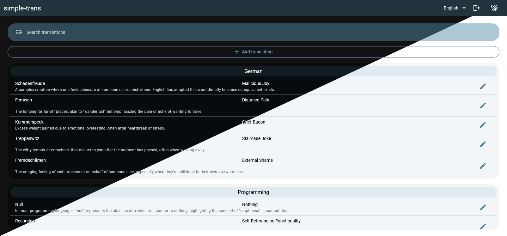

# Simple-Trans 🌐 - Web Translation Dictionary

**Simple-Trans** is a user-friendly, web-based translation dictionary that offers real-time data editing, collections, login functionality, and both dark / light modes. It uses **PocketBase** as the database backend for managing data.

---

## 🚀 Features

- **Real-time Data Edits**: Make updates to translations instantly.
- **Collections**: Group translations together.
- **Login System**: Secure user authentication for editing.
- **Dark/Light Mode**: Seamlessly switch between light and dark themes.
- **Mobile View**: Fully responsive design.
- **Dockerized App**: Easy to deploy with Docker.

---

## 🌐 Web UI



---

## 🐳 Docker Setup Guide

### 📥 Docker Compose (Recommended)

To quickly get started with Simple-Trans, the recommended setup is to use **Docker Compose**. This will allow you to spin up all required services with a single command.

Before running the Docker Compose command, be sure to update the following environment variables in the `docker-compose.yml` file with your preferred email and password:

```yaml
environment:
  - ADMIN_EMAIL=admin@example.com
  - ADMIN_PASSWORD=securepassword123
```

Make sure Docker is installed, then you can start the app from the root directory:

```bash
docker compose up
```

Once the services are running, you can access the simple-trans web UI at:

```
http://<ip>:3000
```

and the PocketBase web UI (database ex. add more user) at:

```
http://<ip>:3000/pb/_/
```

---

### 🗃️ Running Without Docker Compose

While using **Docker Compose** is the recommended method, you can also run Simple-Trans without it. To start the containers individually, follow these steps:

1. **Start PocketBase**:
   ```bash
   docker run -d --name simple-trans -e ADMIN_EMAIL="admin@example.com" -e ADMIN_PASSWORD="securepassword123" -p 3000:80 -v ./data:/pb_data ghcr.io/unterdrueckt/simple-trans:latest
   ```

This will start the Simple-Trans web app, accessible at `http://localhost:3000`.

---

## 🤝 Contributing

Contributions are welcome! Please open an issue or a pull request to improve the simple-trans project.

---

## 📜 License

This project is licensed under the MIT License. See the [LICENSE](LICENSE) file for more details.
